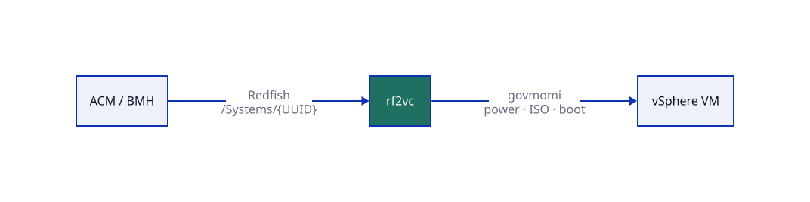
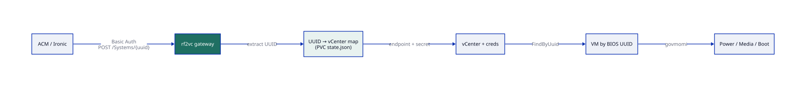

# rf2vc — Redfish → vSphere gateway

Public **Redfish BMC facade** in front of one or more **vCenters**, with a UUID→vCenter
map so ACM/MCE BareMetalHost (`redfish-virtualmedia://.../Systems/<BIOS-UUID>`) routes
to the right inventory.



| | |
|---|---|
| Source | https://github.com/dasmlab/rf2vc |
| Image | `ghcr.io/dasmlab/rf2vc:latest` · `vX.Y.Z` · `X.Y.Z` · `vX.Y.Z-<sha>` (public) |
| Docs | [Architecture](docs/ARCHITECTURE.md) · [OpenShift deploy](deploy/openshift/) |

```
Admin UI ──► /data/state.json (PVC) ──► in-memory map
BMH/Ironic ──Redfish──► rf2vc ──govmomi──► vCenter A / B / …
```

## How it works

**Control path** — ACM posts Redfish actions against `/redfish/v1/Systems/{UUID}`. rf2vc
looks up the UUID, selects the mapped vCenter credentials, finds the VM by BIOS UUID,
then applies power / boot / virtual-media via govmomi.

**ISO path** — `imageSetRef` stays in ACM/Assisted. Ironic sends an ISO URL in
`InsertMedia`; rf2vc hashes it, reuses or uploads to the datastore, and attaches CDROM.

Details + scorecard: **[docs/ARCHITECTURE.md](docs/ARCHITECTURE.md)**



## Deploy on OpenShift

```bash
git clone https://github.com/dasmlab/rf2vc.git && cd rf2vc
git checkout v1.0.0

export RF2VC_AUTH_PASSWORD='pick-a-strong-password'
./scripts/bootstrap-secrets.sh

# optional: StorageClass in deploy/openshift/pvc.yaml ; route host auto-assigned if unset
oc apply -k deploy/openshift/

oc -n rf2vc-system get pods,route
```

### Dashboard login (OpenShift IdP)

The dashboard and `/api` sit behind the OpenShift **oauth-proxy** sidecar; `/redfish` does not.

| Path | Route | Auth |
|---|---|---|
| `/`, `/static`, `/api/v1/*` | `rf2vc` (reencrypt → oauth-proxy :8443 → gateway `127.0.0.1:8081`) | OpenShift login, members of `tdm-chips-admin` |
| `/redfish/*` | `rf2vc-redfish` (same host, `path: /redfish`, edge → gateway :8080) | Basic Auth (BMH credentials, unchanged) |

- **Who gets in:** RBAC. The proxy runs `--openshift-sar` for `get services/rf2vc` in the namespace, and
  Role/RoleBinding `rf2vc-ui-access` grants that to Group `tdm-chips-admin`. Add groups there.
  Check the group exists: `oc get group tdm-chips-admin`.
- **Break-glass:** the `rf2vc-gateway` Secret account also works on the proxy's sign-in page
  (username/password form). An init container writes its bcrypt htpasswd (`rf2vc -write-htpasswd`).
- **Audit:** the signed-in user is shown in the header, and UI changes are logged in Activity → Runtime
  as `ui <METHOD> <path>` with the user.
- Both Routes must use the same explicit `host` (set it in `deploy/openshift/route.yaml`).
- Without `RF2VC_UI_LISTEN` / `uiListen` the gateway keeps the old single listener with Basic Auth
  everywhere (local runs).

BMH example (replace host + secret):

```yaml
bmc:
  address: "redfish-virtualmedia://rf2vc.apps.<cluster>/redfish/v1/Systems/<BIOS-UUID>"
  credentialsName: <secret matching rf2vc auth>
  disableCertificateVerification: true
```

## Local

```bash
cp configs/gateway.example.yaml configs/gateway.yaml
# set auth; mkdir -p data
make build && make run
# UI: http://127.0.0.1:8080/  (basic auth)
```

## API (OpenShift login via oauth-proxy; Basic Auth when running without it)

- `GET /api/v1/status`
- `GET /api/v1/whoami` — signed-in user (`mode`: `oauth` | `basic`)
- `GET|POST /api/v1/vcenters`
- `GET|PUT|DELETE /api/v1/vcenters/{id}`
- `POST /api/v1/vcenters/{id}/test`
- `GET /api/v1/vcenters/{id}/health`
- `GET /api/v1/vcenters/{id}/vms` — recursive VMs under Folder (GOVC_FOLDER)
- `GET /api/v1/vcenters/{id}/iso-status`
- `GET|POST /api/v1/mappings`
- `PUT|DELETE /api/v1/mappings/{uuid}`
- `GET /api/v1/mappings/{uuid}/status`
- `POST /api/v1/mappings/{uuid}/power`

## Diagrams

Sources are D2 under `diagrams/*.d2`. CI renders sibling SVGs (same pipeline as other
dasmlab projects). Locally: `d2 diagrams/rf2vc-overview.d2 diagrams/rf2vc-overview.svg`

## Versioning

Every push to `main` auto-bumps **patch** SemVer (from git tags + `.localbuild`) and publishes:

| Tag | Purpose |
|---|---|
| `latest` | floating tip of main |
| `vX.Y.Z` / `X.Y.Z` | floating tip of that SemVer |
| `vX.Y.Z-<sha>` | immutable build id (GitOps uses this) |

Then creates git tag `vX.Y.Z`.

- Draw a line: `workflow_dispatch` with bump `minor`/`major`, or commit message `[bump minor]` / `[bump major]`
- Local helper: `./commitme.sh point|minor|major "message"` (same pattern as other dasmlab repos)

## Layout

```
cmd/gateway/           main + auth mux
internal/store/        PVC JSON + UUID/vCenter indexes
internal/vsphere/      per-VC client + ISO cache
internal/redfish/      Redfish surface (map-routed)
internal/api/          management REST
web/                   embedded admin UI
deploy/openshift/      portable OCP manifests (kustomize)
diagrams/              D2 sources + rendered SVGs
docs/                  architecture notes
k8s_envelope/          dasmlab GitOps envelope
```
