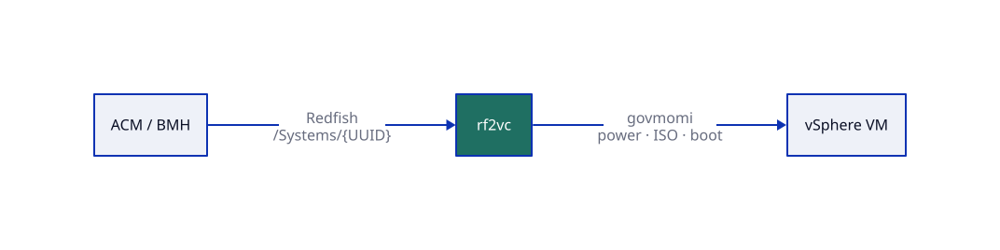
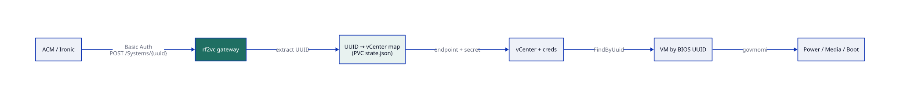
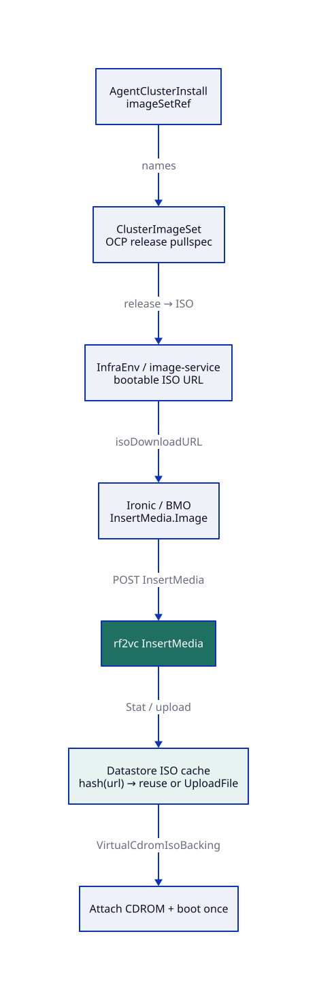

# Architecture

How **rf2vc** sits between ACM BareMetalHost (Redfish virtualmedia) and vSphere.

## Overview



Left hand is the OpenShift / ACM client. Right hand is the VM on vCenter. rf2vc is a thin Redfish BMC facade: it authenticates the caller, maps BIOS UUID → vCenter, then drives govmomi.

## Control path (power, boot, media)



1. BMH calls `redfish-virtualmedia://…/redfish/v1/Systems/<BIOS-UUID>/…` with **gateway** Basic Auth.
2. Gateway looks up the UUID in PVC `state.json`.
3. That mapping yields the vCenter endpoint + credentials.
4. SearchIndex `FindByUuid` (BIOS UUID) locates the VM — or returns not found.
5. Actions: `ComputerSystem.Reset`, PATCH Boot → CD, VirtualMedia Insert/Eject.

**Note:** BMH `credentialsName` matches rf2vc auth. vCenter passwords never leave the gateway map.

## ISO path (ImageSet → datastore CDROM)



`imageSetRef` / ClusterImageSet are **not** handled inside rf2vc. ACM + Assisted image-service turn that into a bootable ISO URL. Ironic POSTs `InsertMedia` with `Image=<url>`. rf2vc then:

1. Hashes the URL → `{sha256[:8]}.iso`
2. Reuses the file on the datastore folder if present (skip `UploadFile`)
3. Otherwise downloads to local cache, uploads, attaches as CDROM, boots CD once

## Fit scorecard

| Area | Score | Notes |
|---|---|---|
| UUID → vCenter → VM routing | **Correct** | Matches the intended design |
| Power On / ForceOff / Restart | **Correct** | Hard power via govmomi |
| ISO hash / cache / attach | **Correct** | Stat-before-upload on datastore |
| Auth model | **Almost** | Global gateway Basic Auth; per-VC secrets for govmomi only |
| GracefulShutdown / Nmi | **Gap** | Advertised; both map to hard PowerOff today |
| GET Boot / media fidelity | **Almost** | Boot GET is static; media status is in-memory |
| imageSetRef inside rf2vc | **N/A (correct)** | Stays upstream; ISO arrives as InsertMedia URL |
| Full BMC Redfish catalog | **Thin** | Systems + VirtualMedia — enough for BMH virtualmedia |

## Diagram sources

Edit the `.d2` files under `diagrams/`. CI (`.github/workflows/d2-diagrams.yml`) re-renders sibling `.svg` files on push. Locally:

```bash
d2 diagrams/rf2vc-overview.d2 diagrams/rf2vc-overview.svg
```
